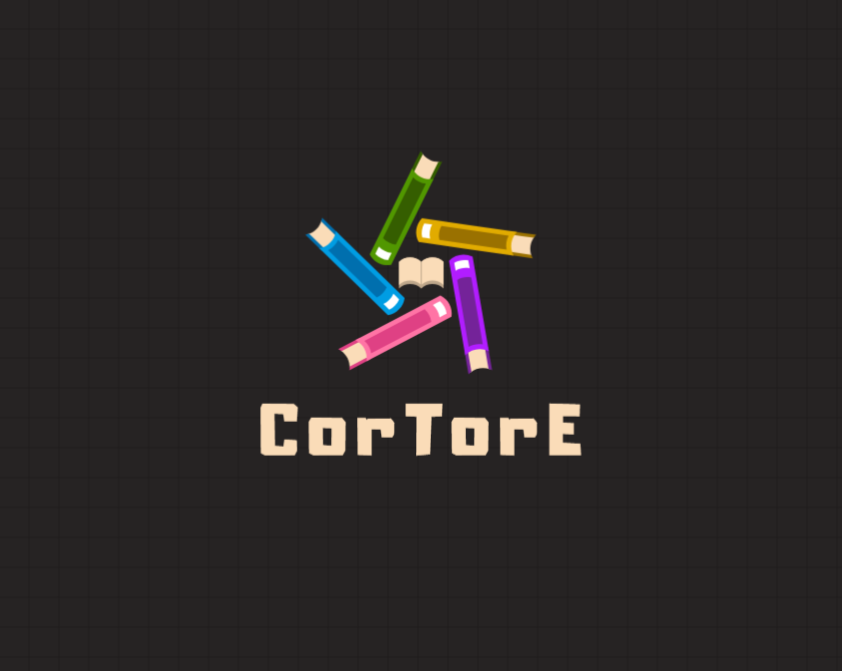

<h2>CorTorE</h2>
<h3>(Coding or Travel or Education)</h3>
    

 

---

### ✨ **소개**

우리는 협업과 성장을 목표로 다양한 스터디를 진행합니다.

TBD

### 📚 **진행 중인 스터디 목록**

| **스터디 명**      | **기간**  | **참여자**                     | **리뷰어**|
| ------------------ | --------- | ------------------------------ | -------------- |
| 블로깅 스터디      | 2024.11 ~ | 강병준, 양재서, 이영수            |강병준, 양재서, 이영수, 이원호  |
| 알고리즘 문제 풀이 | 2024.11 ~ | 강병준                            |이원호        |

### 🙌 **참여 방법**

1. 진행 중인 스터디의 README를 확인합니다.
2. 이슈를 생성하여 참여 의사를 남깁니다.
